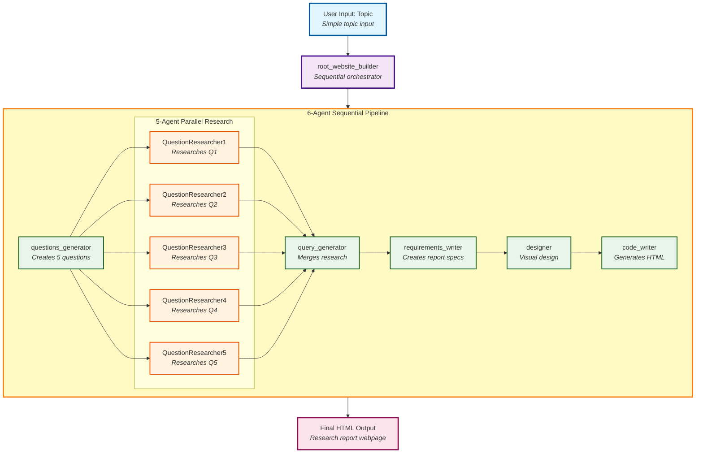

# Intelligent Research-Driven Website Builder Agent Flow

## Complete System Architecture

## Key Features Illustrated:

### 🎯 **Sequential Orchestration**
- Root agent manages the entire 6-agent pipeline
- Each agent runs in sequence, passing data through state keys

### ⚡ **Parallel Processing** 
- 5 research agents run simultaneously for efficiency
- All research outputs feed into the query generator

### 📊 **Data Flow**
- Dotted lines show how data flows between agents via state keys
- Each agent's output becomes the next agent's input

### 🔄 **Research-Driven Approach**
- Topic → Questions → Research → Synthesis → Requirements → Design → Code
- Every webpage built on comprehensive research foundation

---

## Usage in VS Code:

1. Install **"Mermaid Preview"** extension
2. Open this file in VS Code
3. Use `Ctrl+Shift+P` → "Mermaid Preview: Open Preview to the Side"
4. The diagram will render beautifully with interactive elements