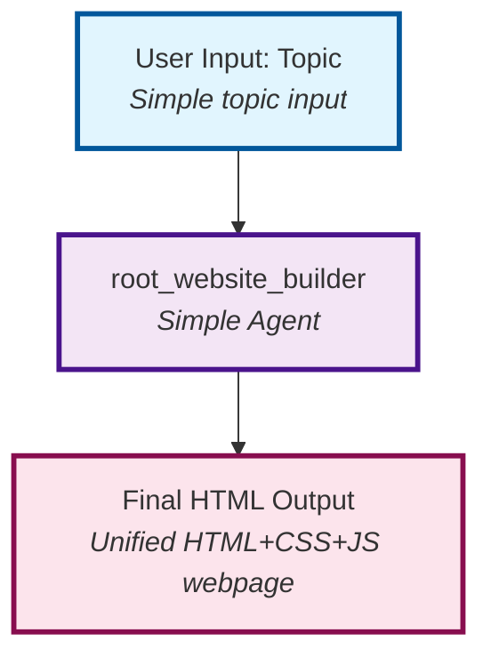

# Simple Webpage Generator

```mermaid
flowchart TD
    USER[User Input: Topic<br/><i>Simple topic input</i>]
    ROOT[root_website_builder<br/><i>Simple Agent</i>]
    OUTPUT[Final HTML Output<br/><i>Unified HTML+CSS+JS webpage</i>]

    USER --> ROOT
    ROOT --> OUTPUT

    classDef userStyle fill:#e1f5fe,stroke:#01579b,stroke-width:3px
    classDef orchestratorStyle fill:#f3e5f5,stroke:#4a148c,stroke-width:3px
    classDef agentStyle fill:#e8f5e8,stroke:#1b5e20,stroke-width:2px
    classDef outputStyle fill:#fce4ec,stroke:#880e4f,stroke-width:3px
    classDef pipelineStyle fill:#fff9c4,stroke:#f57f17,stroke-width:3px

    class USER userStyle
    class ROOT orchestratorStyle
    class RW,DES,CW agentStyle
    class OUTPUT outputStyle
    class PIPELINE pipelineStyle
```
